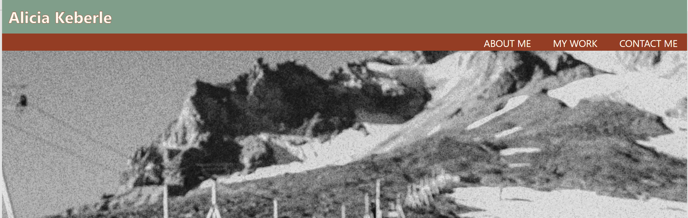

# AK Professional Portfolio

## Description

This repository was made with a goal to create myself a professional portfolio that showcases the skill i've learned in HTML and CSS. This repoository was built in order to make changes to the code without affecting the live website. This portfolio allowed me to utilize skills I learned in class of initializing a repository, creating an html file, a css file, and folder for images and using these individual parts to create a functial web application. This application will be developed further as I learn new skills and I will be able to show case my work in one centralized location.

## Usage

https://keberlea.github.io/akportfolio/

## Credits

University of Oregon- EDex bootcamp

## License